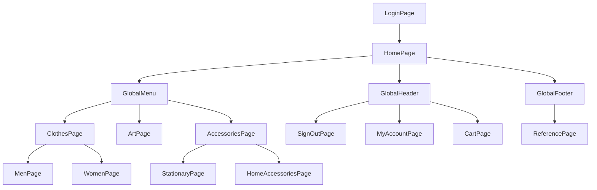
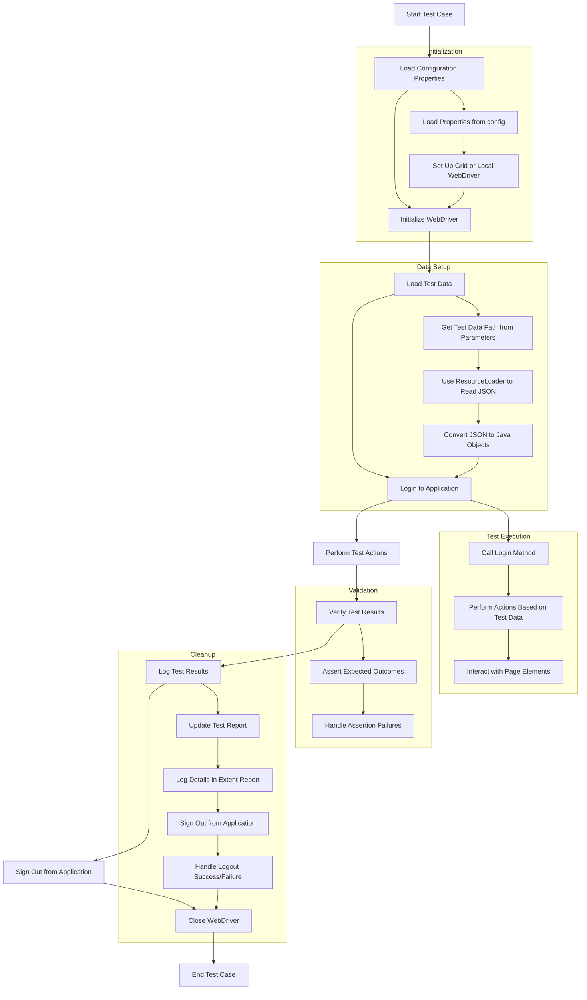

# Selenium Automation Framework

## Overview

This Selenium automation framework is designed for testing a web application using the Page Object Model (POM) pattern. The framework utilizes Selenium WebDriver with TestNG for test execution, and incorporates Cucumber for behavior-driven development (BDD). It supports parallel test execution and integrates with Extent Reports for reporting.

## Framework Structure

### Pages

The framework follows the Page Object Model pattern, organizing page elements and actions into distinct classes. Here are the key page classes in the framework:

- **GlobalHeader**: Represents the header section visible on all pages.
- **GlobalFooter**: Represents the footer section visible on all pages.
- **GlobalMenu**: Represents the global menu for navigation.

### Pages Hierarchy

The following Mermaid diagram illustrates the page hierarchy and relationships in the framework:

### Test Case Flow

The following Mermaid diagram illustrates the test case flow:

